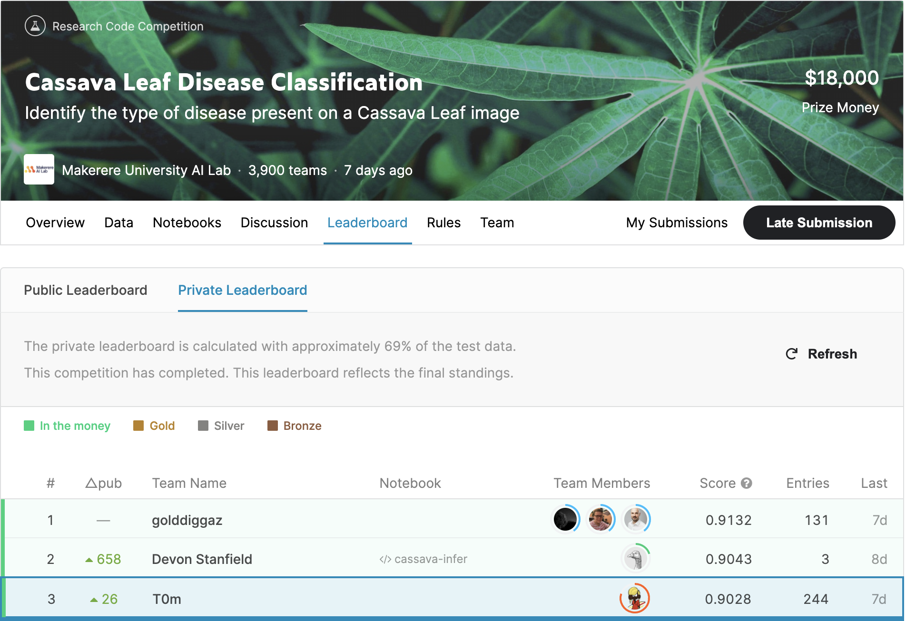
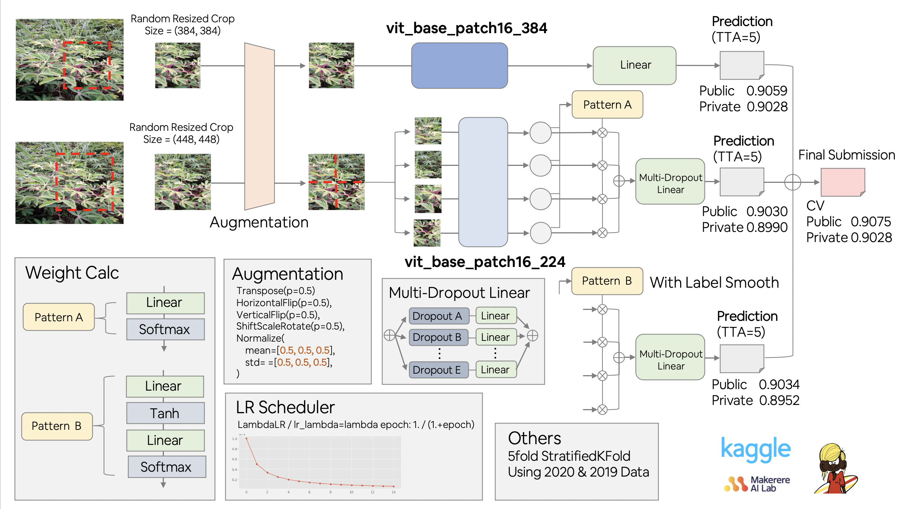

# Cassava Leaf Disease Classification 3rd Place Solution
  - kaggle Cassava Leaf Disease Classification 2020
  - 3rd Place Solution

### LeaderBoard
<p align="center">
    
</p>

### Discussion (witeup)
- https://www.kaggle.com/c/cassava-leaf-disease-classification/discussion/221150

### Summary
<p align="center">
    
</p>

### How to run
```
# run pipeline
$ python main.py

# debug mode
$ python main.py --debug

# use multi-gpu
$ python main.py --multi-gpu
```

### Requirements
- dataset
  - Merged JPEG Dataset [Duplicates Removed]
  - https://www.kaggle.com/c/cassava-leaf-disease-classification/discussion/200201
